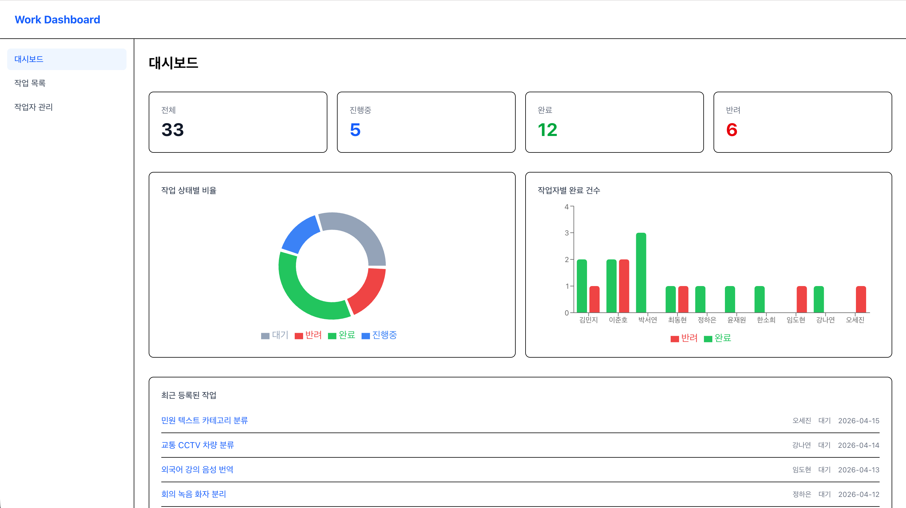
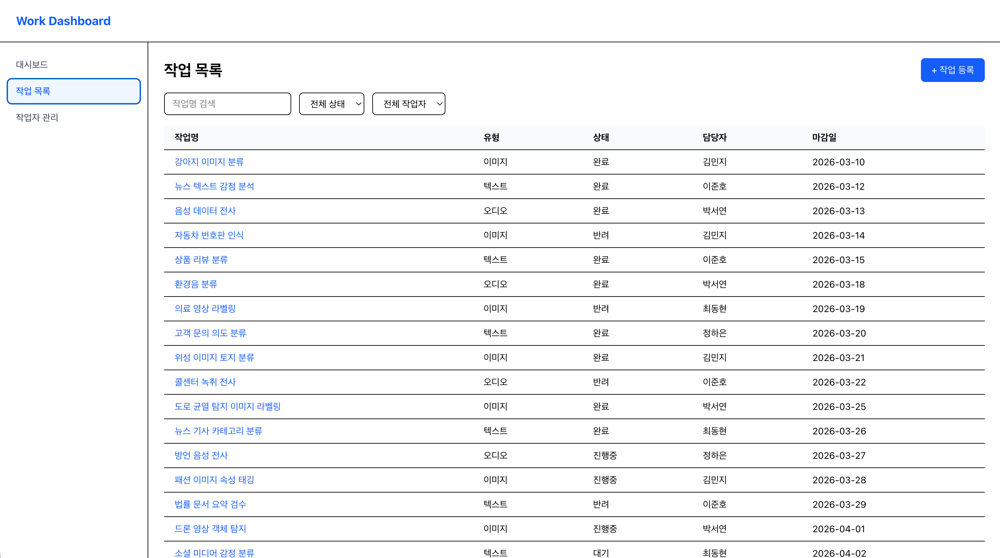
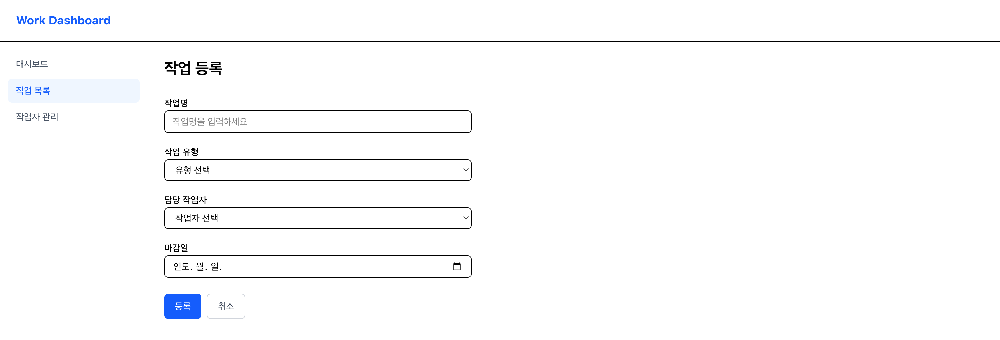
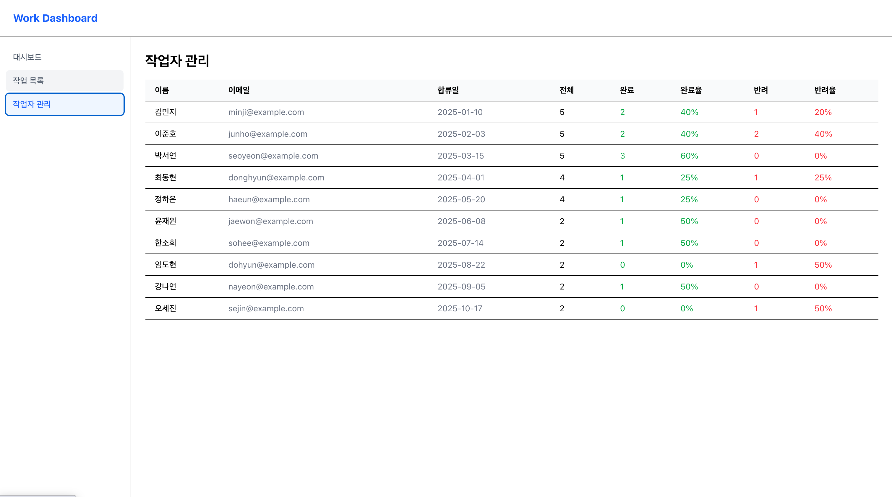

# Work Dashboard

크라우드소싱 플랫폼에서 작업자 관리, 데이터 시각화, 회계 시스템 등을 개발하며 쌓은 경험을 바탕으로, 작업 현황을 한눈에 관리하고 시각화하는 태스크 관리 대시보드를 직접 설계하고 구현했습니다. 실무에서 자주 마주쳤던 대시보드 구조와 상태 관리 패턴을 사이드 프로젝트로 정리한 결과물입니다.

**Demo:** [https://work-dashboard-vercel.vercel.app](https://work-dashboard-vercel.vercel.app)

## 스크린샷

| 대시보드 홈                                      | 작업 목록                                  |
| ------------------------------------------------ | ------------------------------------------ |
|  |  |

| 작업 등록                                      | 작업자 관리                                    |
| ---------------------------------------------- | ---------------------------------------------- |
|  |  |

## 기술 스택

| 분류        | 기술                       |
| ----------- | -------------------------- |
| 프레임워크  | Next.js 16 (App Router)    |
| 언어        | TypeScript                 |
| 스타일      | Tailwind CSS v4            |
| 상태 관리   | TanStack Query v5, Zustand |
| 차트        | Recharts                   |
| 폼          | react-hook-form            |
| API Mocking | MSW v2                     |
| 테스트      | Vitest                     |
| 배포        | Vercel                     |

## 주요 기능

### 대시보드 홈 (`/`)

- 전체 / 진행중 / 완료 / 반려 작업 요약 카드
- 작업 상태별 비율 도넛 차트
- 작업자별 완료/반려 건수 바 차트
- 최근 등록된 작업 목록 5건

### 작업 목록 (`/tasks`)

- 전체 작업 테이블
- 상태 / 작업자 필터링 및 작업명 검색

### 작업 등록 (`/tasks/new`)

- 작업명 / 작업 유형 / 담당 작업자 / 마감일 입력
- react-hook-form 기반 유효성 검사

### 작업 상세 (`/tasks/[id]`)

- 작업 정보 조회 및 수정
- 커스텀 확인 모달을 통한 작업 삭제

### 작업자 관리 (`/workers`)

- 작업자 목록
- 작업자별 완료율 / 반려율 통계

### 다크모드

- 라이트 / 다크 / 시스템 세 가지 테마 지원
- 헤더 토글 버튼으로 전환 (시스템 → 라이트 → 다크 순환)
- 선택한 테마는 쿠키에 저장되어 페이지 새로고침 후에도 유지
- SSR 시점에 쿠키를 읽어 `<html>` 태그에 `dark` 클래스를 적용하므로 FOUC 없음
- 시스템 모드에서는 OS 다크모드 설정을 실시간으로 감지

## 프로젝트 구조

```
├── app/
│   ├── _components/        # 대시보드 전용 컴포넌트
│   │   ├── StatCard.tsx
│   │   ├── StatusDonutChart.tsx
│   │   ├── WorkerBarChart.tsx
│   │   └── RecentTaskList.tsx
│   ├── providers/          # QueryProvider, MSWProvider, ThemeProvider
│   ├── tasks/
│   │   ├── page.tsx        # 작업 목록 진입점
│   │   ├── TasksClient.tsx # 목록 테이블 + 필터 + 검색
│   │   ├── new/
│   │   │   ├── page.tsx          # 작업 등록 진입점
│   │   │   └── NewTaskClient.tsx # 등록 폼
│   │   └── [id]/
│   │       ├── page.tsx              # 작업 상세 진입점
│   │       └── TaskDetailClient.tsx  # 상세 조회 + 수정 + 삭제
│   └── workers/            # 작업자 관리 페이지
├── components/
│   ├── layout/             # Header, Sidebar, LayoutShell
│   └── ui/                 # 공통 UI 컴포넌트 (Button, Input, Select, Loading, ConfirmModal, ThemeToggle)
├── constants/              # 상태/유형 레이블 상수
├── hooks/                  # 커스텀 쿼리 훅 (useTasksQuery, useTaskQuery, useWorkersQuery, useStatsQuery)
├── mocks/                  # MSW 핸들러 및 목업 데이터
├── store/                  # Zustand 스토어 (themeStore)
└── types/                  # Task, Worker, Stats 타입 정의
```

## 시작하기

```bash
# yarn
yarn install
yarn dev

# npm
npm install
npm run dev
```

[http://localhost:3000](http://localhost:3000) 에서 확인할 수 있습니다.

## 테스트

Vitest + Testing Library 기반으로 테스트를 작성했습니다.

```bash
# watch 모드
yarn test

# 단일 실행
yarn test:run
```

### 테스트 범위

| 대상            | 파일                                                                              |
| --------------- | --------------------------------------------------------------------------------- |
| 상수            | `constants/task.ts`                                                               |
| UI 컴포넌트     | `Button`, `Input`, `Select`, `StatCard`, `Loading`, `ConfirmModal`, `ThemeToggle` |
| 페이지 컴포넌트 | `TasksClient`, `WorkersClient`                                                    |
| 스토어          | `themeStore`                                                                      |
| Provider        | `ThemeProvider`                                                                   |

```
__tests__/
├── helpers/
│   └── renderWithProviders.tsx  # QueryClient 래퍼 헬퍼
├── constants/
│   └── task.test.ts
├── store/
│   └── themeStore.test.ts
├── providers/
│   └── ThemeProvider.test.tsx
└── components/
    ├── ui/
    │   ├── Button.test.tsx
    │   ├── Input.test.tsx
    │   ├── Select.test.tsx
    │   ├── Loading.test.tsx
    │   ├── ConfirmModal.test.tsx
    │   └── ThemeToggle.test.tsx
    ├── StatCard.test.tsx
    ├── TasksClient.test.tsx
    └── WorkersClient.test.tsx
```

## 기술적 의사결정

### MSW를 프로덕션에서도 활성화

실제 백엔드 없이 배포가 가능하도록 MSW를 개발 환경뿐 아니라 프로덕션에서도 활성화했습니다. `MSWProvider`에서 환경 분기 없이 항상 Service Worker를 등록하도록 처리했습니다.

> 이 결정은 포트폴리오 배포 목적에 한정한 방식으로, 실제 서비스에서는 개발 환경에서만 활성화하는 것이 적합합니다. 프로덕션에서 MSW를 활성화할 경우 불필요한 Service Worker 등록 오버헤드가 발생할 수 있다는 점을 인지하고 선택한 트레이드오프입니다.

### 사이드바 상태 관리에 Zustand 미사용

사이드바 열림/닫힘은 특정 페이지나 컴포넌트에서만 필요한 로컬 UI 상태입니다. 전역 스토어(Zustand 등)로 관리하는 방식도 검토했으나, 이 상태를 필요로 하는 곳이 `LayoutShell` 단일 컴포넌트뿐이었기 때문에 `useState`로 처리했습니다. 불필요한 의존성 추가를 줄이고 상태의 범위를 명확히 하기 위한 결정입니다.

### 다크모드 테마 저장을 localStorage 대신 쿠키로 처리

Zustand의 `persist` 미들웨어를 이용한 `localStorage` 저장 방식을 먼저 구현했으나, 이 경우 테마 클래스 적용이 `useEffect` 이후에 이루어져 FOUC(Flash of Unstyled Content)가 발생했습니다. 이를 해결하기 위해 쿠키 기반 방식으로 전환했습니다.

Next.js App Router의 `layout.tsx`는 서버 컴포넌트이므로 `next/headers`의 `cookies()`로 요청 시점에 쿠키를 읽어 `<html>` 태그에 `dark` 클래스를 직접 포함해 HTML을 내려줄 수 있습니다. 덕분에 클라이언트 스크립트 실행 이전에 이미 올바른 테마가 적용된 상태로 렌더링됩니다.

테마 변경 시에는 Zustand `setTheme` 액션 내부에서 `document.cookie`에 직접 저장하고, `ThemeProvider`는 서버에서 읽은 초기값을 마운트 시점에 스토어에 동기화합니다.

### 커스텀 쿼리 훅 분리

`useQuery` 호출이 6개 컴포넌트에 중복되어 있었습니다. `useTasksQuery`, `useTaskQuery`, `useWorkersQuery`, `useStatsQuery` 4개의 훅으로 분리해 fetch 로직을 단일 위치에서 관리하도록 했습니다. `queryKey` 구조와 `staleTime` 설정을 훅 내부에서 통일함으로써, 캐시 무효화 정책 변경 시 수정 포인트를 최소화할 수 있습니다. React Context를 통해 전달하는 방식도 고려했으나, 커스텀 훅이 사용 측에서 더 직관적이라 판단했습니다.

### 컴포넌트 배치 기준

| 위치               | 기준                                     |
| ------------------ | ---------------------------------------- |
| `components/ui/`   | 여러 페이지에서 재사용되는 범용 UI       |
| `app/_components/` | 대시보드 홈에서만 사용하는 전용 컴포넌트 |

## 트러블슈팅

### Next.js 16 dynamic params 비동기 처리

Next.js 16부터 `params`가 비동기로 변경되어 `params.id`를 직접 참조하면 타입 오류가 발생합니다.

```ts
// ❌ Next.js 15 이하
export default function Page({ params }: { params: { id: string } }) {
  return <TaskDetailClient id={params.id} />;
}

// ✅ Next.js 16
export default async function Page({ params }: { params: Promise<{ id: string }> }) {
  const { id } = await params;
  return <TaskDetailClient id={id} />;
}
```

### Testing Library에서 동일 텍스트 중복 탐지

`getByText('김민지')`가 `<option>` 요소와 `<td>` 요소에서 동시에 발견되어 에러가 발생했습니다. `getAllByText`로 변경한 뒤 `tagName`을 확인하는 방식으로 해결했습니다.

```ts
// ❌ 중복 요소로 에러
expect(screen.getByText('김민지')).toBeInTheDocument();

// ✅ 특정 요소 타입으로 한정
const elements = screen.getAllByText('김민지');
expect(elements.some((el) => el.tagName === 'TD')).toBe(true);
```

### Recharts Tooltip formatter 타입 추론 오류

`formatter` prop에 명시적으로 `number` 타입을 선언하면 Recharts 내부 타입과 충돌이 발생했습니다. 타입 선언을 제거하고 TypeScript가 추론하도록 변경해 해결했습니다.

```ts
// ❌ 타입 충돌
formatter={(value: number) => `${value}건`}

// ✅ 타입 추론에 위임
formatter={(value) => `${value}건`}
```

## Mock API

MSW를 사용해 개발 환경에서 API를 모킹합니다.

| Method | Endpoint         | 설명                                |
| ------ | ---------------- | ----------------------------------- |
| GET    | `/api/tasks`     | 작업 목록 조회 (필터 파라미터 포함) |
| GET    | `/api/tasks/:id` | 작업 상세 조회                      |
| POST   | `/api/tasks`     | 작업 등록                           |
| PATCH  | `/api/tasks/:id` | 작업 수정                           |
| DELETE | `/api/tasks/:id` | 작업 삭제                           |
| GET    | `/api/workers`   | 작업자 목록 조회                    |
| GET    | `/api/stats`     | 대시보드 통계 조회                  |

## 향후 계획

- [ ] 실제 백엔드 연동 (Next.js API Routes + DB)
- [ ] 로그인 / 인증 기능 추가
- [ ] 작업 마감일 기반 알림 기능
- [x] 다크 모드 지원
- [ ] E2E 테스트 추가 (Playwright)
